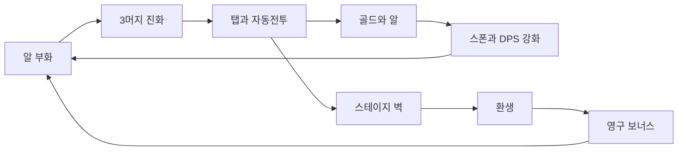

# Hatchlings — 제품 기획

**가칭:** Hatchlings  
**장르:** Idle / Clicker + Merge  
**플랫폼:** iOS / Android (1차), Web으로 빠른 스모크  
**패키지:** `com.hatchlings.idle`  
**스토어:** Casual / Simulation + RPG 태그  
**연령:** 12+ / Teen (아이들=idle이지 아동용이 아님. 광고·IAP → COPPA 회피)

---

## 한 줄 피치

알을 부화시키고, 같은 크리처 3마리를 합쳐 진화시키고, 전장에서 탭/자동 공격으로 스테이지를 밀고, 앱을 꺼도 골드가 쌓인다. 막히면 환생해 영구 보너스를 얻는다.

---

## 왜 이 장르인가

대형 아이들 RPG(MapleStory Idle, AFK Journey 등)는 IP·가챠·라이브옵스 경쟁이다. 인디가 이길 자리는 **언어 의존이 적고, 10초 안에 이해되며, 소규모로 출시 가능한 루프**다.

| 선택 | 이유 |
|------|------|
| Merge | 짧은 도파민, 보드 만족감 |
| Tap combat | 세션 참여감 (Tap Titans류) |
| Offline growth | 리텐션 (Egg Inc류) |
| Cute creatures | 글로벌 비주얼, 텍스트 부담↓ |

**v1에서 빼는 것:** 풀 가챠. EU/스토어 정책·브랜드·밸런스 비용이 크다. 첫 수익은 **보상형 광고 + 타임스킵/젬 IAP + (후순위) 배틀패스 훅**.

레퍼런스: Legend of Mushroom, Tap Titans 2, Egg Inc, Merge 캐주얼.

---

## 코어 루프

### 세션 (2–5분)
- 전장 탭 → 버스트 데미지
- 5×4 둥지에서 알/크리처 머지
- 골드 업그레이드 구매
- (페이즈 3) 보상형 광고로 2× 골드 또는 타임스킵

### 오프라인
- DPS 기반 골드·알 생산
- 상한 **8시간** (재접속 시 정산 팝업)

---

## 경제 (밸런스 = 콘텐츠)

재화 3종만 유지한다.

| 재화 | 용도 |
|------|------|
| Gold | 업그레이드 |
| Gems | 프리미엄 (광고/IAP) |
| Time Crystals | 환생 메타재화 → 영구 골드 배율 |

핵심 수식은 코드가 아니라 [`assets/data/balance.json`](../assets/data/balance.json)에 둔다.

- 적 HP ≈ `baseHp * hpGrowth^(stage-1)`
- 업그레이드 비용 ≈ `baseCost * costGrowth^level`
- 오프라인 골드 ≈ `min(elapsed, 8h) * goldPerSec`
- **첫 환생 목표:** 적극 플레이 ~15–30분 / 캐주얼 ~30–45분, 스테이지 ≈ 50

크리처 정의: [`assets/data/creatures.json`](../assets/data/creatures.json)

---

## 화면 구성

| 영역 | 내용 |
|------|------|
| 상단 ~55% | Flame 전장 (적, 탭, HP/스테이지) |
| 하단 ~45% | Nest / Upgrades / Album / Shop / Rebirth |
| 오버레이 | 재화 HUD, 오프라인 정산 팝업 |

아트 원칙 (페이즈 1–2): 단순 벡터/치비 플레이스홀더 + **강한 피드백**(데미지 플로터, 콤보, 스쿼시). 스파인급은 루프가 검증된 뒤.

---

## 현재 구현 상태 (페이즈 1 슬라이스)

완료:
- 탭 + 자동 DPS, 스테이지 진행
- 업그레이드 3종 (Tap / Auto / Gold Find)
- 오프라인 정산 + SharedPreferences 세이브
- 크리처 티어 0–6, 3머지
- 영문 UI, K/M/B 숫자
- 상점 광고/IAP **스텁**
- Rebirth (스테이지 50+)

미완 / 페이즈 2+:
- 유물 상점 UI 고도화, 일일 미션, 크리처 라인 분기
- 실 AdMob / IAP / Firebase
- 로컬라이즈, 스토어 자산

자세한 일정은 [ROADMAP.md](ROADMAP.md).
